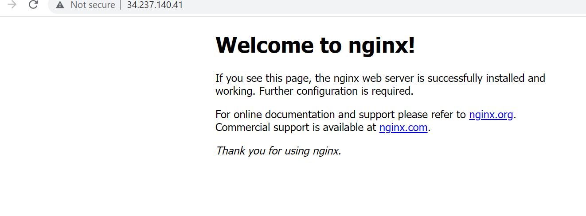
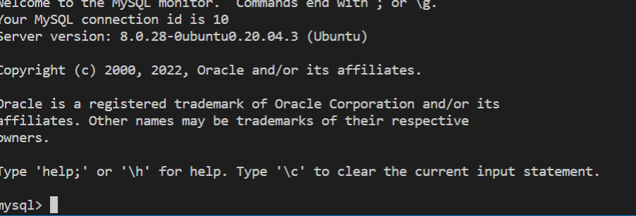
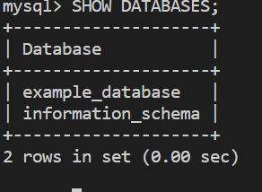
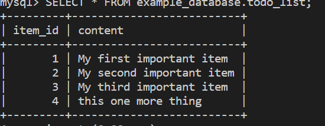
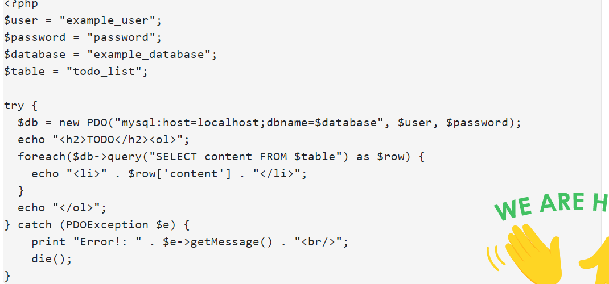
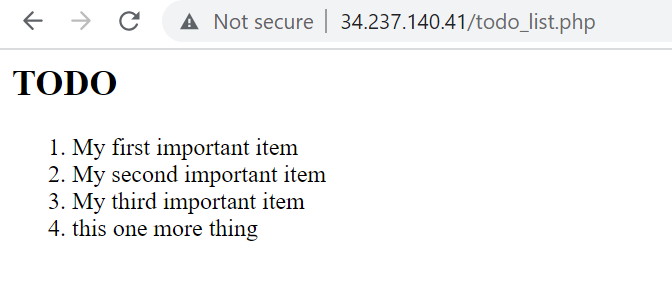

# LEMP STACK IMPLEMENTATION
### INSTALLING NGINX WEB SEREVER
**.** update Ubuntu's package index `sudo apt update` install nginx server `sudo apt install nginx`
**.** Verify success of installation `sudo systemctl status nginx`

**.** Verifying locally from our ubuntu shell `curl http://127.0.0.1:80`
**.** Testing how Nginx responds to request from internet 
[Nginxinstalled](http://<Public-DNS-Name>:80)

### INSTALLING MYSQL
**.** Install mysql usin apt `curl sudo apt install mysql-server` 
Run security scripts that comes preinstalled with sql `sudo mysql_secure_installation`

**.** Log into `sudo mysql` 

### INSTALLING PHP
**.** Install php-mysql and php-fpm(Nginx requires this) at once `sudo apt install php-fpm php-mysql`

### CONFIGURING NGINX TO USE PHP
#### CREATING SERVER BLOCKS
**.** Create the root web directory for your_domain `sudo mkdir /var/www/projectLEMP`

**.** Assign ownership to the directory PROJECTLEMP `sudo chown -R $USER:$USER /var/www/projectLEMP`

**.** Open and edit a new configuration file in Nginx site available directory usin nano
`sudo nano /etc/nginx/sites-available/projectLEMP`

**.** Activate your configuration by linking to the config file from Nginx’s sites-enabled directory and then test it
`sudo nginx -t`

**.** Disable the default Nginx host and then reload to apply changes

**.** Create an index.html file in /var/www/projectLEMP so that we can test that our new server block works as expected:
`sudo echo 'Hello LEMP from hostname' $(curl -s http://169.254.169.254/latest/meta-data/public-hostname) 'with public IP' $(curl -s http://169.254.169.254/latest/meta-data/public-ipv4) > /var/www/projectLEMP/index.html`

**.** To confirm Nginx is working as expected, go to browser and put
[Configuredwebsite](http://<Public-DNS-Name>:80)

### TESTING PHP WITH NGINX
**.** Create a test PHP file in document root
`sudo nano /var/www/projectLEMP/info.php`

PS C:\Users\Rukayat>

### RETRIEVING DATA 
**.** Connect to Mysql and create a new database
`sudo my sql` 
`CREATE DATABASE`example_database`;`

**.** Create a new user and give the new user a password
`CREATE USER 'example_user'@'%' IDENTIFIED WITH mysql_native_password BY 'password';`

**.** Grant the new user permission over the database
`GRANT ALL ON example_database.* TO 'example_user'@'%';`

**.** Exit the mysql console, login again to test permission granted and then confirm access to the database created
`SHOW DATABASES;`

**.** Create a table named todo_list

**.** Insert values into table
`INSERT INTO example_database.todo_list (content) VALUES ("My first important item");`

**.** Select all data from the table
`SELECT * FROM example_database.todo_list;`

**.** Create a new PHP file (todo_list.php) `nano /var/www/projectLEMP/todo_list.php` and paste the script below to connect to mysql

**.** Accessing the page in web browser should give this:

